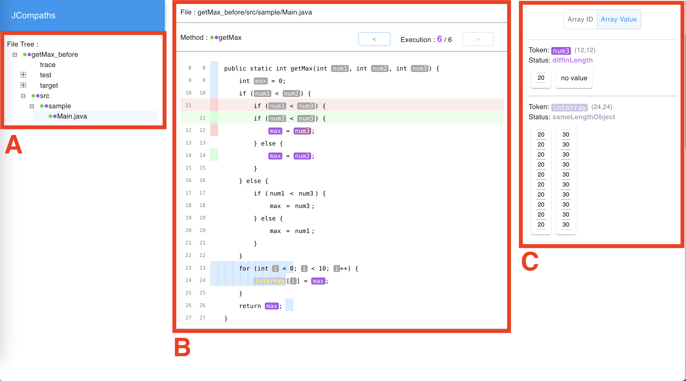
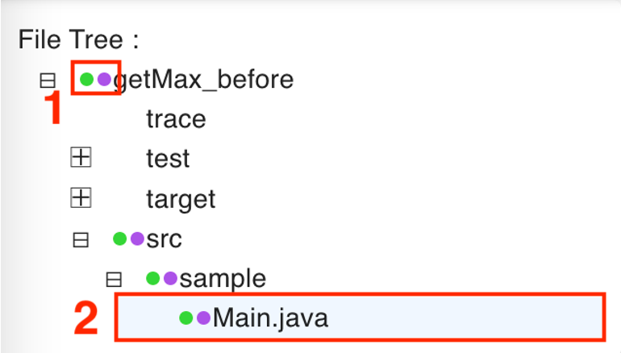
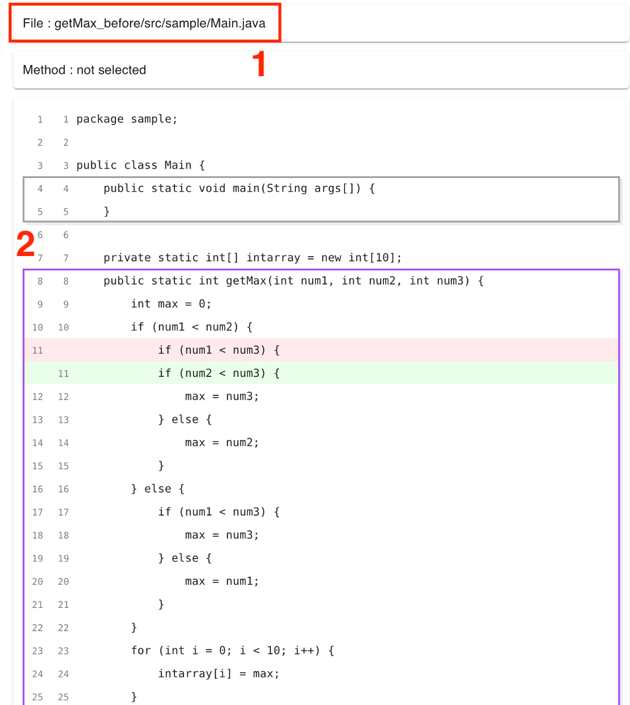
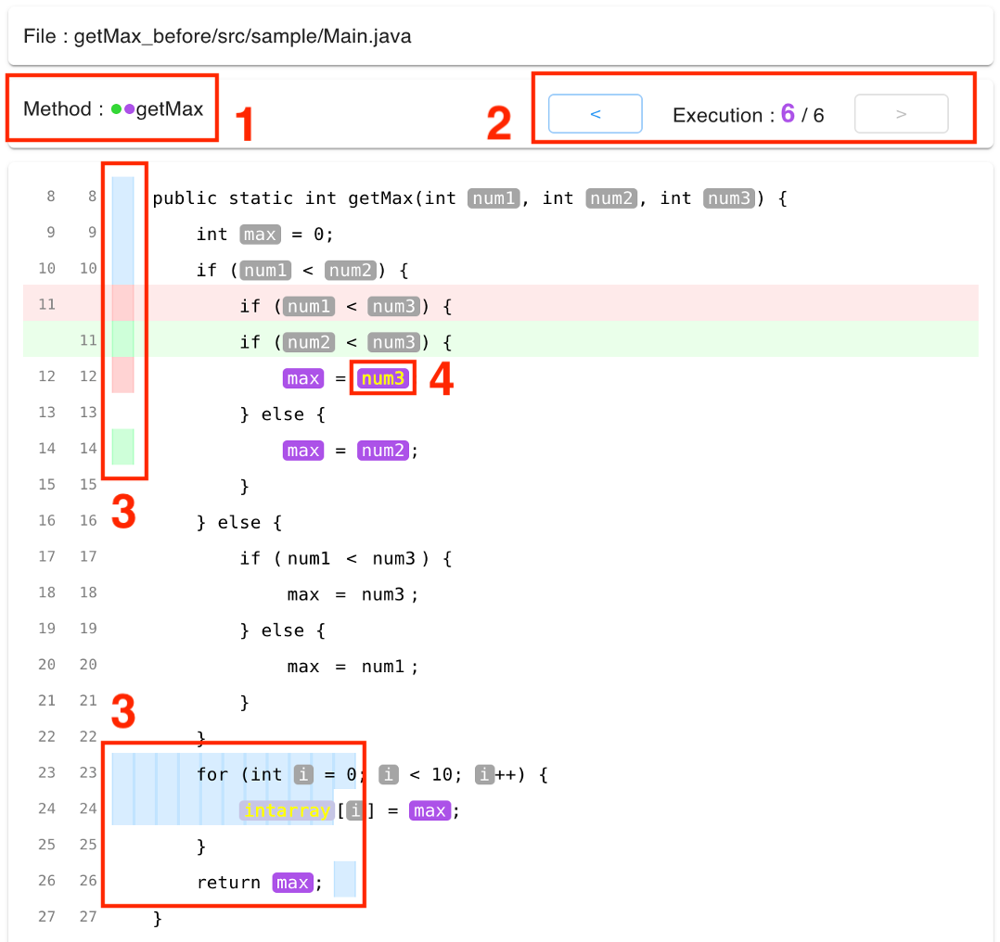
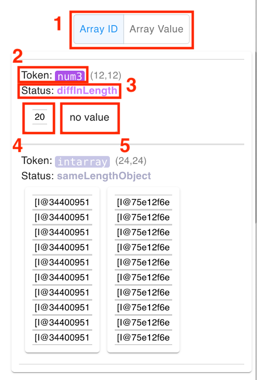

# JCompaths
JCompathsは，Javaプログラムにおけるソースコードの変更前後におけるメソッドの実行の変化を可視化するツールです．
任意のメソッドに着目し，その実行を1回ずつ，ソースコードの変更前後で比較することができます．
特に，次の2点について重点的に可視化を行います．
- 変数トークンのトレース
  - ソースコード中の変数トークンが，プログラム実行時にとった値の系列のことです．
  - ソースコードの変更前後で差分がある部分を簡単に発見できます．
- メソッドの実行経路
  - 実行されたソースコード各行の系列のことです．
  - 矩形で実行経路を表すことで，その差分を直観的に理解できます．

変数トークンの差分の有無やメソッドの実行経路は，ソースコードの差分表示の上にマッピングされています．
これにより，よく利用されているソースコードの差分表示の利点を生かしつつ実行の変化を確認することができます．

## ライセンス
このソフトウェアはMITライセンスに基づき公開されています．詳細は [LICENSE](./LICENSE) を参照してください．

## 要件
* Node.js `>= Node v20`
* Java Runtime Environment `>= Java 8`

## コンポーネント

### 変更前後それぞれの実行時情報の取得および解析

* SELogger `= v0.2.3`
  * `selogger-0.2.3.jar` をリポジトリに同梱
* NOD4J post processor 改造版
  * `nod4jc-0.5.jar` をリポジトリに同梱
  * オリジナルとの差分は [パッチファイル](nod4j.8a26752.patch) を参照

### 変更前後間の差分計算

* `merger` ディレクトリ
  * npmレジストリに登録していないため，初回利用時はビルドが必要です
  * Webビューア側に呼び出しスクリプトを置いてあるので，直接実行する必要はありません

### Webビューアでの可視化

* `viewer` ディレクトリ
  * 解析・差分計算結果を格納したのちビルド・起動するとWebアプリ上で情報を閲覧できます

## 動作デモ

サンプルプログラムの実行・比較結果が格納されているため，ビューアを起動することで可視化の様子を確認することができます．
```sh
git clone https://github.com/tetsuyakanda/jcompaths
cd <CLONED_ROOT>/viewer
npm run start
```


## 使用手順

### 準備
リポジトリをクローンし，各種パッケージをインストールしてください．
```sh
git clone https://github.com/tetsuyakanda/jcompaths
cd <CLONED_ROOT>/merger
npm install
cd <CLONED_ROOT>/viewer
npm install
```

### 実行の記録

可視化したいJavaアプリケーション（ソースコード変更前）を実行し，SELoggerにより実行時情報を記録します．
```sh
java -jar -javaagent:<CLONED_ROOT>/selogger-0.2.3.jar=output=/path/to/<EXECUTION_RECORD> <YOUR_APP.jar>
```

記録結果は`/path/to/<EXECUTION_RECORD>`に出力されます．
各ファイルの中身については，[SELogger/wiki/データ形式](https://github.com/takashi-ishio/selogger/wiki/%E3%83%87%E3%83%BC%E3%82%BF%E5%BD%A2%E5%BC%8F)を参照してください．

### 実行記録の解析

Javaアプリケーションのソースコード（変更前）と，その実行時情報の記録から，変数トークンのトレースと実行経路を解析します．

```sh
java -jar <CLONED_ROOT>/nod4jc-0.5.jar /path/to/<PROJECT_SRC> /path/to/<EXECUTION_RECORD> <CLONED_ROOT>/viewer/public/assets/proj1
```
解析結果として，`fileinfo.json`，`varinfo.json`，`methodinfo.json`の3つのファイルが，`<CLONED_ROOT>/viewer/public/assets/proj1`直下に出力されます．

### 変更後の実行の記録と解析

ソースコード変更後のJavaアプリケーションに対して，
解析結果の出力先を`<CLONED_ROOT>/viewer/public/assets/proj2`に変更した上で，
同様の手順で記録と解析を行ってください．

### マージ

ソースコードの変更前後における，解析結果の差分を計算し，マージします．

```sh
cd <CLONED_ROOT>/viewer
npm run load
```

内部的にはリポジトリ内の`merger`コンポーネントを実行しています.
マージ結果として，`target.json`が`<CLONED_ROOT>/viewer/public/assets`直下に出力されます．

### 可視化

ビューアを起動し，実行を可視化します．

```sh
npm run start
```

ブラウザで`localhost:3000`にアクセスし，情報を閲覧することができます．

## ビューアの仕様

ビューアの概観は以下のようになり，3つのビューで構成されています．



### A: ファイルツリービュー

解析したプロジェクト内のファイルを一覧します．



- 1: ファイルの差分ステータス
  - 緑の円は，ソースコードに差分があることを表します．
  - 紫の円は，ファイル中のいずれかの変数トークンについて，トレースに差分があることを表します．
- 2: 選択中のファイル
  - 選択したファイルの中身がソースコードビューに表示されます．

### B: ソースコードビュー

ファイルツリービューでファイルを選択すると，ソースコードビューに以下のようなにメソッド選択画面が表示されます．



- 1: 選択中のファイルのパス
- 2: メソッド選択表示
  - メソッドに含まれるいずれかの変数トークンのトレースに差分がある場合，枠が紫色になります．

メソッドを選択すると，ソースコードビューはメソッドの詳細表示に切り替わります．



- 1: 選択中のメソッド名
- 2: 実行の切り替え
  - メソッドが実行された回数と，現在選択中の実行のインデックスが表示されます．
  - 左右のボタンで選択中の実行を切り替え可能です．
  - トレースに差分がある場合，インデックスが紫色になります．
- 3: 実行経路表示
  - 選択中の実行について，その実行経路を矩形で表示します．各矩形は，配置されている行が実行されたことを表しており，矩形を上から下，左から右に辿ることで実行経路が得られます．
  - 赤の矩形はソースコードの変更前にのみ実行された経路，緑の矩形は変更後にのみ実行された経路，青の矩形は変更前後で共通する経路を表します．
- 4: 変数トークン
  - トレースの差分に応じて表のように色分けされています．
  - クリックでトークンを選択すると，そのトレースがトレースビューに表示されます．再びクリックすると選択を解除できます．複数を同時に選択状態にすることが可能です，

    |  トークンの色  |  差分の状態  |
    | ---- | ---- |
    |  白  |  トレースなし  |
    |  灰  |  差分なし  |
    |  紫  |  差分あり  |
    |  薄い青  |  ※  |

    ※ 薄い青は，トレースの長さが同じであるが，プリミティブ型の変数でないため，具体的な値を比較できないことを表します．

### C: トレースビュー



- 1: 配列の表示モード
  - Array ID : トレースとして常にオブジェクトIDを表示
  - Array Value : 配列の特定の要素が参照された場合，トレースとしてその具体的な値を表示
- 2: 選択中のトークン名
- 3: トークンの差分ステータス
- 4: ソースコード変更前のトレース
  - プリミティブ型の変数トークンの場合，その変数の具体的な値が表示されるが，それ以外の場合は基本的に型名+オブジェクトIDが表示される．
- 5: ソースコード変更後のトレース
